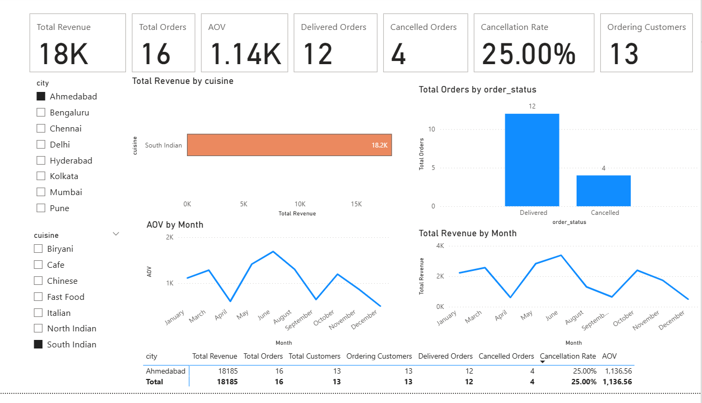
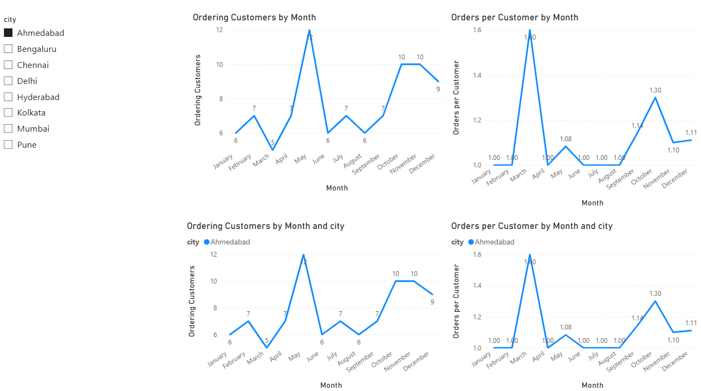
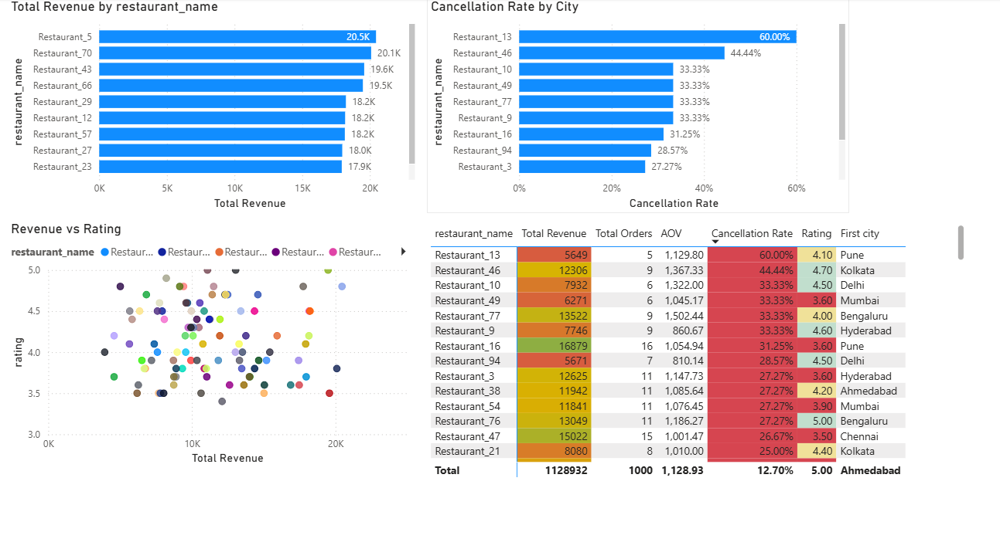
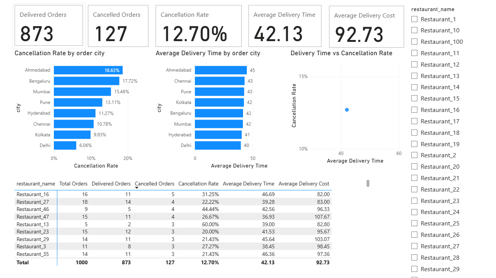

# FoodRush Analytics

**End-to-end SQL + Power BI analytics case study for a food-delivery platform**

FoodRush Analytics simulates the work of a Data Analyst investigating a food-delivery business from raw operational data through data quality checks, SQL business investigations, dimensional modelling, DAX measures, and an interactive Power BI dashboard.

The project is intentionally focused on a practical analyst workflow: **define the business question → validate the data → analyse the drivers → identify exceptions → present the result for decision-making.**

---

## Business Problem

FoodRush needs to understand four things:

1. **Executive performance** — revenue, orders, customers, AOV and order outcomes.
2. **Customer behaviour** — repeat purchasing, retention/churn, purchase frequency and customer value.
3. **Restaurant performance** — revenue, order volume, ratings and cancellation risk.
4. **Operational performance** — cancellations, delivery time and delivery cost, with drill-down to city and restaurant level.

---

## Analytical Approach

```text
Raw operational data
        ↓
ETL / Data Quality
        ↓
SQL business investigations
        ↓
Dimensional model
        ↓
DAX measures
        ↓
Power BI dashboards
        ↓
Business findings & investigation paths
```

### Analytical layers used

| Layer | Example questions |
|---|---|
| Descriptive | What are revenue, orders, AOV and cancellation levels? |
| Trend | How do revenue, orders and AOV change over time? |
| Diagnostic | Are order changes driven by customer count or order frequency? |
| Segmentation | Which customer / restaurant groups behave differently? |
| Exception analysis | Which restaurants or cities require investigation? |

---

## Dataset

Four core tables are used:

| Table | Grain | Purpose |
|---|---|---|
| `customers` | 1 row = 1 customer | Customer attributes and acquisition information |
| `restaurants` | 1 row = 1 restaurant | Restaurant, cuisine, city and rating attributes |
| `orders` | 1 row = 1 order | Revenue, order status, delivery and cost metrics |
| `website_sessions` | 1 row = 1 session | Traffic source, device and conversion behaviour |

The database schema is documented in [`schema/schema.sql`](schema/schema.sql).

---

## SQL Investigations

The SQL layer contains 14 business tickets covering the following areas:

- Acquisition channel value
- Repeat customer rate by city
- Month-over-month revenue
- Revenue decomposition / RDA
- Top customers by city
- Pareto customer concentration
- Customers spending above city average
- Customers with no delivered orders
- Month-to-month customer retention
- Monthly customer churn
- Purchase behaviour using `LAG()`, `LEAD()`, `FIRST_VALUE()` and `LAST_VALUE()`
- Customer value ranking and segmentation using `DENSE_RANK()` and `NTILE()`
- Customer lifecycle segmentation
- Restaurant performance intelligence and segmentation

See the complete SQL work in [`sql/`](sql/).

### Advanced SQL demonstrated

`CTEs` • `CASE` • `LEFT JOIN` / `INNER JOIN` • conditional aggregation • `LAG()` • `LEAD()` • `FIRST_VALUE()` • `LAST_VALUE()` • `ROW_NUMBER()` • `DENSE_RANK()` • `NTILE()` • `AVG() OVER()` • `SUM() OVER()` • `PARTITION BY` • self joins • date manipulation • anti-join patterns.

---

## ETL / Data Quality

The [`ETL Final/`](ETL%20Final/README.md) folder contains both training and production-oriented SQL work covering:

- raw-layer extraction
- dataset profiling
- null/completeness checks
- duplicate detection
- key validation
- numeric and date validation
- category standardisation
- business-rule validation
- rejected-record / exception handling
- final QA validation

The central principle is to **profile before cleaning** and to keep rejected records auditable rather than silently deleting them.

---

## Power BI Dashboard

The Power BI report contains four pages:

### 1. Executive Overview

Answers: **How is FoodRush performing overall?**

Key views include revenue, orders, ordering customers, AOV, delivered/cancelled orders, cancellation rate, revenue trends, cuisine contribution and city performance.

### 2. Customer Intelligence

Answers: **What is happening with customer activity?**

Key views include ordering customers by month, orders per customer, and city-level customer behaviour.

### 3. Restaurant Intelligence

Answers: **Which restaurants require attention?**

Key views include top revenue restaurants, high-cancellation restaurants, revenue vs rating, and restaurant-level operational detail.

### 4. Operations Intelligence

Answers: **Where are operational issues concentrated?**

Key views include cancellation rate by order city, average delivery time by order city, delivery time vs cancellation rate, and restaurant-level operational metrics.

The editable report is included at [`PowerBI/FoodRush.pbix`](PowerBI/FoodRush.pbix).

---

## Selected Dashboard Screenshots

### Executive Overview



### Customer Intelligence



### Restaurant Intelligence



### Operations Intelligence



---

## Key Findings Demonstrated in the Dashboard

The dashboard is designed to move from a KPI to a driver and then to an exception.

### Example — operational investigation

The dashboard baseline shows an overall cancellation rate of **12.70%**. The order-city view shows **Ahmedabad at 18.63%**, above the overall rate. The analysis then drills into restaurant-level performance rather than claiming a cause from the city comparison alone.

One example identified during the investigation was **Restaurant_38**, with **27.27% cancellation across 11 orders** and an average delivery time of **46.18 minutes**. This is treated as an investigation candidate, not proof that delivery time caused the cancellations.

### Example — customer behaviour

The customer page decomposes order activity into:

```text
Orders
  ├── Ordering Customers
  └── Orders per Customer
```

This makes it possible to distinguish a decline in the number of customers ordering from a decline in frequency among customers who remain active.

---

## What This Project Demonstrates

**Data preparation:** Power Query / ETL and data-quality validation  
**SQL:** business investigation, CTEs, joins, conditional aggregation and advanced window functions  
**Data modelling:** fact/dimension thinking and relationship design  
**DAX:** reusable measures, `CALCULATE()`, ratios and filter context  
**BI:** interactive Power BI dashboard design and drill-down analysis  
**Business analysis:** driver decomposition and exception-based investigation  

---

## Repository Structure

```text
FoodRush-Analytics/
│
├── data/
│   ├── customers_v3.csv
│   ├── orders_v3.csv
│   ├── restaurants_v3.csv
│   ├── website_sessions_v3.csv
│   └── README.md
│
├── schema/
│   └── schema.sql
│
├── ETL Final/
│   ├── Production/
│   └── Training/
│
├── sql/
│   ├── Ticket 1 ... Ticket 14
│   └── README.md
│
├── powerbi/
│   ├── FoodRush.pbix
│   └── README.md
│
├── screenshots/
│   ├── 01_Executive_Overview.png
│   ├── 02_Customer_Intelligence.png
│   ├── 03_Restaurant_Intelligence.png
│   └── 04_Operations_Intelligence.png
│
└── docs/
    ├── analysis_summary.md
    └── interview_story.md
```

---

## How to Reproduce

1. Load the CSV files from `data/` into the SQL environment.
2. Create the base schema using `schema/schema.sql`.
3. Run the ETL scripts in `ETL Final/` where applicable.
4. Run the SQL investigation tickets in `sql/`.
5. Open `powerbi/FoodRush.pbix` in Power BI Desktop.
6. Review the four dashboard pages and interact with the filters / selections.

---

## V1 Scope & Limitations

FoodRush V1 is a focused portfolio project rather than a production platform. The repository does **not** claim that every possible food-delivery analytics problem has been solved.

Some analyses are exploratory and identify investigation candidates rather than proving causality. For example, a relationship between delivery time and cancellation rate should not be interpreted as causal without additional testing.

The current repository is intentionally centred on **SQL, ETL/data quality, dimensional modelling, DAX and Power BI**. Python is not presented as a completed project component because no Python implementation is included in this repository.

---

## Portfolio Objective

The project is intended to demonstrate that the analyst can move beyond isolated queries or charts and build a connected analytical workflow from **data quality → SQL analysis → data model → BI reporting → defensible business interpretation**.
